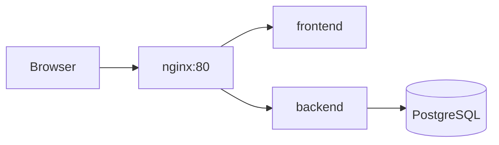

# Fintech risk monitoring

Take-home scope is defined in [TASK.md](TASK.md). The stack includes a **FastAPI** backend (PostgreSQL, SQLModel, Alembic, async SQLAlchemy) and a **React** frontend (Vite, TanStack Router, TanStack Query, Hey API codegen).

**AI tooling:** I used **Cursor** and **ChatGPT** to speed up initial project structure and boilerplate (scaffolding, README drafts). Core API design, risk-evaluation flow, and final integration were reviewed and adjusted manually.

## Architecture (short)

- **API** (`/api/v1`): businesses CRUD/list/filter, detail with risk summary, async evaluation trigger (`202`), risk history.
- **Worker**: in-process `asyncio` task simulates slow scoring after the HTTP response.
- **Frontend**: React SPA; API client generated from OpenAPI via `@hey-api/openapi-ts`.



## Architecture decisions

**Async evaluation (HTTP 202)** — Risk scoring is modeled as a long-running job. The API creates a `pending` row, returns immediately with `202 Accepted`, and an in-process worker completes the simulation after a configurable delay. This mirrors how real risk engines are integrated without blocking HTTP threads.

**PostgreSQL + SQLModel** — Evaluations are persisted with full history (scores, levels, status, errors). SQLModel keeps models and API schemas aligned; Alembic manages schema migrations.

**Hey API codegen** — The frontend client and TanStack Query hooks are generated from the backend OpenAPI spec so the UI stays type-safe when routes change.

**In-process worker (tradeoff)** — `asyncio.create_task`. A production system would use a durable queue (e.g. Redis + workers (celery for ex)), idempotent job handling, and retries. Jobs do not survive process restarts; duplicate evaluate requests while one is active return **409 Conflict**.

## Run with Docker (full stack)

The **nginx** service publishes **port 80** on the host (`127.0.0.1:80` in `docker-compose.yml`). Make sure nothing else is listening on port 80 or change the port in `docker-compose.yml`

### Make .env
```bash
cp backend/.env.example backend/.env
```

### Run the services
```bash
docker compose up --build
```

### Seed the db with example data
Run in new console
```bash
docker compose exec backend python scripts/seed_data.py
```

### Then open:

| URL | Service |
| --- | --- |
| http://127.0.0.1 | React UI |
| http://127.0.0.1/api/v1/docs | Swagger |

## Demo walkthrough

1. Open http://127.0.0.1 after `docker compose up --build`.
2. **Create** a business (name required) on the home page.
3. Click the business name to open **detail**.
4. Click **Trigger risk evaluation** — the button disables while a job is active; the UI polls every 2s.
5. After a few seconds, **Latest completed risk** shows score and level; **Risk history** lists the evaluation row as `completed`.
6. On the home page, use **Filters** (name substring, risk level) to narrow the list.

Optional: explore the API in Swagger at http://127.0.0.1/api/v1/docs.

## API mapping to TASK.md

| TASK route | This repo |
| --- | --- |
| `POST /businesses` | `POST /api/v1/businesses` |
| `GET /businesses` | `GET /api/v1/businesses?name=&risk_level=&skip=&limit=` |
| `GET /businesses/{id}` | `GET /api/v1/businesses/{id}` |
| `POST /businesses/{id}/evaluate` | `POST /api/v1/businesses/{id}/evaluate` → **202** (409 if already running) |
| `GET /businesses/{id}/risk-history` | `GET /api/v1/businesses/{id}/risk-history` |

Poll business detail or history while `pending_evaluation` is set.

## Limitations

- Evaluation jobs are **in-process** (`asyncio.create_task`), not a durable queue.

## Tests

API tests run against Postgres inside the Compose stack (separate DB `riskdb_test`, created automatically). Start the stack first:

```bash
docker compose up -d --build
docker compose exec backend sh -c 'pip install -q -r requirements-dev.txt && PYTHONPATH=. pytest -q'
```

`pip install` is only needed once per container rebuild (or add `requirements-dev.txt` to the backend image if you prefer).

## Frontend (local dev)

```bash
cd frontend
cp .env.example .env   # optional; see below
pnpm install
pnpm dev               # http://127.0.0.1:5173 — proxies /api/v1 → backend
```

Requires the API on port **8000** with `DEBUG=true` (for OpenAPI during `pnpm openapi`).

### Regenerate API client

When backend routes or schemas change:

```bash
# export OpenAPI (from repo root, with venv + backend deps)
cd backend && PYTHONPATH=. DEBUG=true python -c "
from app.main import app
import json
from pathlib import Path
Path('../frontend/openapi.json').write_text(json.dumps(app.openapi(), indent=2))
"

cd ../frontend && pnpm openapi
```
